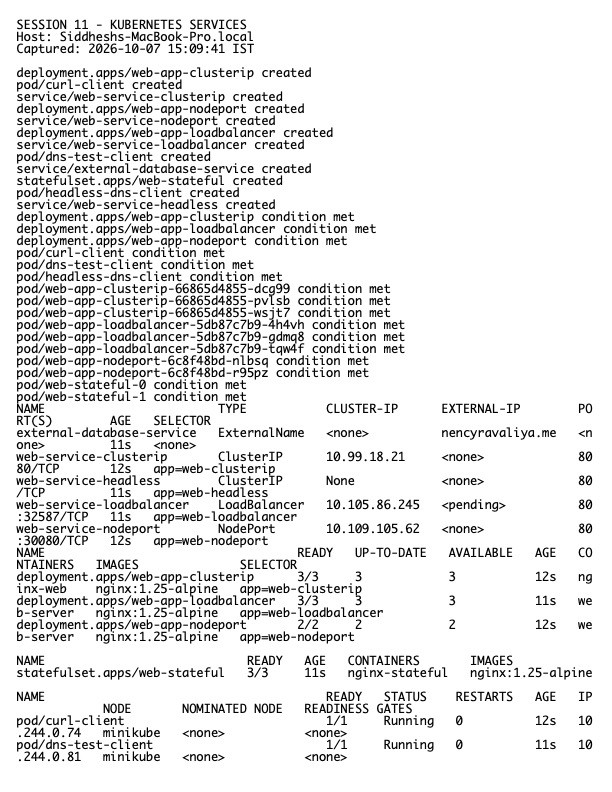

# Session 11 Homework — Kubernetes Networking and Services

**Host:** `Siddheshs-MacBook-Pro.local`  
**Namespace used for the lab:** `homework-s11`

## Five Service types

- **ClusterIP:** internal stable virtual IP; tested from a client Pod.
- **NodePort:** exposes the Service on a port on every node.
- **LoadBalancer:** requests an external load balancer; on Minikube the external address can remain pending unless `minikube tunnel` is running.
- **ExternalName:** returns a DNS CNAME and creates no proxy/endpoints.
- **Headless:** `clusterIP: None`; DNS returns individual Pod addresses and is useful with StatefulSets.

The manifests and detailed per-type explanations are in `../01-clusterip/` through `../05-headless/`.

## Object comparisons

| Objects | Main distinction |
|---|---|
| Deployment vs ReplicaSet | A ReplicaSet maintains identical Pods; a Deployment manages ReplicaSets and declarative rollouts/rollback. |
| Deployment vs DaemonSet vs StatefulSet | Deployment is for interchangeable replicas; DaemonSet schedules one Pod per eligible node; StatefulSet gives stable identity, ordered rollout, and stable storage. |
| ReplicaSet vs Service | ReplicaSet controls Pod count; Service provides stable discovery and traffic routing to matching ready Pods. |

Scaling a Deployment changes replica count. A DaemonSet scales with nodes. A StatefulSet can scale replicas but preserves ordinal identities and PVC relationships. Services decouple clients from short-lived Pod IPs.

## Required DNS documentation

- [FQDN notes](./fqdn/README.md)
- [CoreDNS notes](./coredns/README.md)

## Evidence

Raw output: `evidence.txt`.
