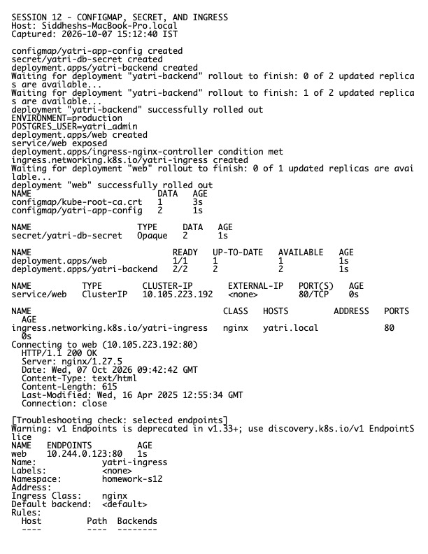

# Session 12 Homework — Ingress, ConfigMaps, and Secrets

**Host:** `Siddheshs-MacBook-Pro.local`  
**Namespace used for the lab:** `homework-s12`

## Completed work

- Created a ConfigMap and consumed values as container environment variables.
- Created a Secret and injected it into a Pod without printing the sensitive value in committed files.
- Deployed frontend/backend Services and an Ingress, enabled the Minikube ingress add-on, and verified routing.
- Diagnosed the supplied base64/selector troubleshooting examples and recorded before/after checks.

## Ingress vs Ingress Controller

An **Ingress** is an API object containing desired HTTP(S) host/path routing rules. An **Ingress Controller** is the running implementation (for example ingress-nginx) that watches those objects and configures a real reverse proxy/load balancer. Creating only an Ingress produces no data-plane routing; installing only a controller produces no application-specific rules. Both are required.

Secrets are base64-encoded Kubernetes objects, not encrypted by default. They must not contain real credentials in Git. Production systems should enable encryption at rest, RBAC, rotation, and preferably an external secret manager.

## Source material

- ConfigMap: `../01-configmap/`
- Secret: `../02-secret/`
- Ingress: `../03-ingress/`
- Integrated demo: `../04-full-demo/`
- Troubleshooting: `../troubleshooting/`

## Evidence

Raw output: `evidence.txt`.
