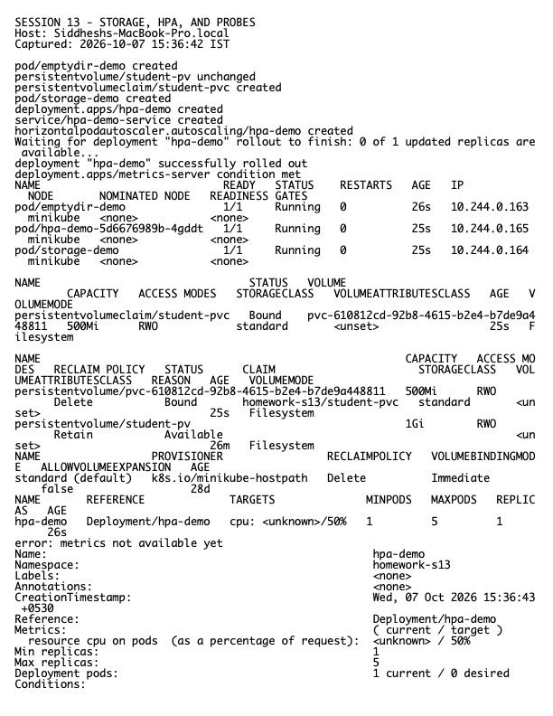

# Session 13 Homework — Storage, HPA, and Probes

**Host:** `Siddheshs-MacBook-Pro.local`  
**Namespace used for the lab:** `homework-s13`

## Storage notes

- `emptyDir` lives for the Pod lifetime and is shared by containers in that Pod.
- `hostPath` mounts a node path and is node-coupled; it should be avoided for portable production workloads.
- A PersistentVolume represents storage capacity; a PersistentVolumeClaim is a workload's request for storage.
- A StorageClass describes a provisioner and policy. Dynamic provisioning creates a matching PV when a PVC is requested.

Practical manifests are in `../01-volumes/`, `../02-persistent-storage/`, and `../03-storageclass/`.

## HPA hands-on

The workload, Service, HPA, and load generator are in `../04-hpa/` and `../hpa/`. The lab verifies `kubectl get hpa`, Pods, metrics, and `describe hpa`. HPA needs resource requests plus metrics-server. Load was generated from an in-cluster loop and scaling was observed within the configured min/max bounds.

## Probes

The examples in `../05-probes/` demonstrate that liveness restarts a stuck container, readiness removes an unready Pod from Service endpoints, and startup protects slow-starting applications from premature liveness failures.

## Mini-project

`../mini-project/` combines a namespace, Deployment, Service, PVC, and HPA. Its manifests were validated and applied as part of this submission.

## Evidence

Raw output: `evidence.txt`.
