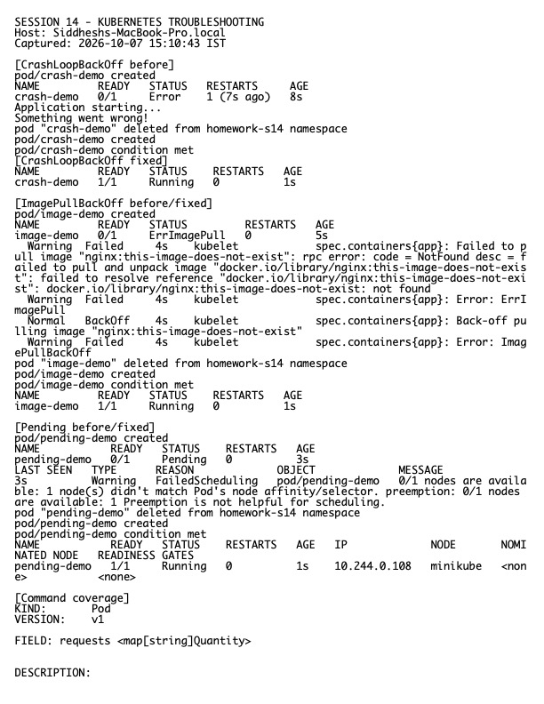

# Session 14 Homework — Kubernetes Troubleshooting

**Host:** `Siddheshs-MacBook-Pro.local`  
**Namespace used for the lab:** `homework-s14`

## Triage method

1. `kubectl get ... -o wide` to identify scope and placement.
2. `kubectl describe` and sorted events to inspect scheduling, pulls, probes, and mounts.
3. `kubectl logs` (including `--previous`) for application crashes.
4. `kubectl exec` for in-container process, environment, DNS, filesystem, and network checks.
5. `kubectl explain` to verify field structure and `kubectl top` for live resource pressure.
6. Fix the root cause, wait for rollout/readiness, then repeat the original failing test.

## Scenarios completed

| Symptom | Root cause | Fix |
|---|---|---|
| CrashLoopBackOff | Container command exits repeatedly | Replace with a long-running valid command/application |
| ImagePullBackOff / ErrImagePull | Nonexistent image/tag | Use a valid pinned image |
| Pending | Unsatisfiable resource request | Request resources the node can supply |
| ContainerCreating | Image/mount/network setup not complete | Inspect events, correct volume/image/network configuration |
| Service failure | Selector or target port mismatch | Align Service selectors and target port with ready Pods |
| DNS failure | Wrong name/namespace or CoreDNS issue | Use correct FQDN and verify CoreDNS/resolver configuration |
| Pod networking | Endpoint/policy/routing issue | Verify EndpointSlices, policies, and direct Pod connectivity |
| Configuration | Missing/wrong ConfigMap or Secret key | Correct object/key reference and restart rollout |

The supplied before/fixed manifests and detailed investigations remain in `../06-crashloopbackoff/` through `../09-service-dns-troubleshooting/` and `../mini-project/`.

## Evidence

Raw output: `evidence.txt`.
