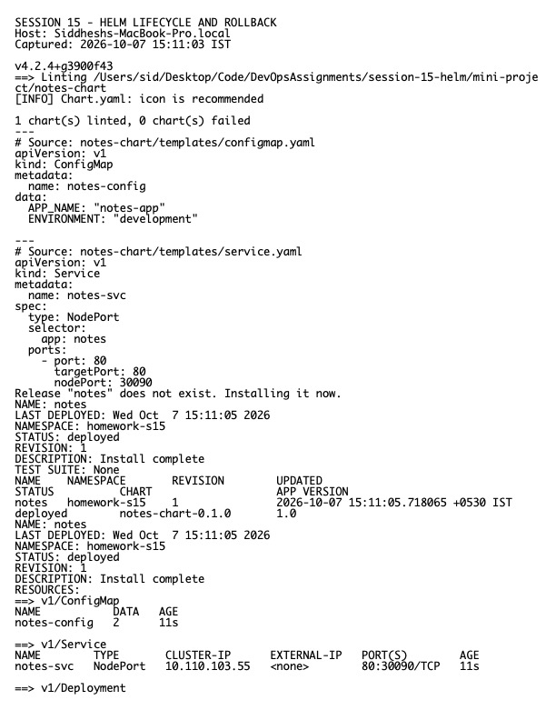

# Session 15 Homework — Helm

**Host:** `Siddheshs-MacBook-Pro.local`  
**Namespace used for the lab:** `homework-s15`

## Commands practiced

`helm create`, `lint`, `template`, `install`, `list`, `status`, `get values`, `get manifest`, `upgrade`, `history`, `rollback`, `repo list`, `search repo`, and `uninstall`.

## Rollback workflow

1. Install revision 1 with the initial image/configuration.
2. Upgrade to revision 2 and verify Deployment readiness.
3. Upgrade to revision 3 with another visible value change.
4. Inspect `helm history`.
5. Roll back to revision 2 and verify the live release values and Pods.

The chart demonstrates `Chart.yaml`, default and environment-specific values, templates, helpers, labels, Services, Deployments, and value overrides. The mini-project is documented in `../mini-project/`.

## Evidence

Raw output: `evidence.txt`.
