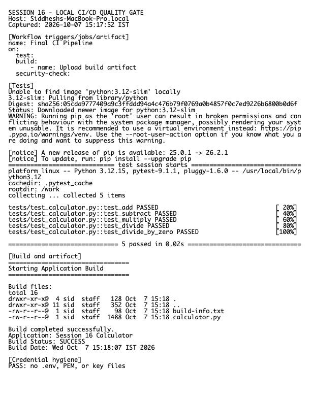

# Session 16 Homework — CI/CD and GitHub Actions

**Host:** `Siddheshs-MacBook-Pro.local`

## Demo project

The completed demo is in `../session-16-github-actions/10-final-cicd-pipeline/`. It contains application code, tests, a build script, dependency file, `.gitignore`, and `.github/workflows/ci.yml`.

The workflow demonstrates:

- push and pull-request triggers;
- a hosted runner;
- checkout, setup, install, test, build, and artifact steps;
- job/step ordering and failure propagation;
- CI (build/test) separated conceptually from CD (release/deploy);
- secrets referenced through the GitHub `secrets` context rather than committed values.

The earlier folders demonstrate parallel/sequential jobs, matrices, runner types, conditions, manual/scheduled/path triggers, secrets, and upload/download artifacts.

## CI vs CD

CI automatically integrates changes and gives fast build/test feedback. Continuous delivery keeps a releasable artifact ready for a controlled deployment; continuous deployment automatically promotes every passing change. Jobs run on runners and contain ordered steps. Artifacts preserve build outputs or reports between jobs and after a run.

## Verification

The project tests and build script were executed locally as the same quality gate used by Actions. Workflow YAML files were parsed/inspected and contain no hard-coded credentials.

Raw output: `evidence.txt`.

> A hosted GitHub Actions screenshot cannot be produced from this clone because `origin` points to the instructor repository and the configured GitHub CLI token is invalid. No push or third-party repository mutation was attempted.
