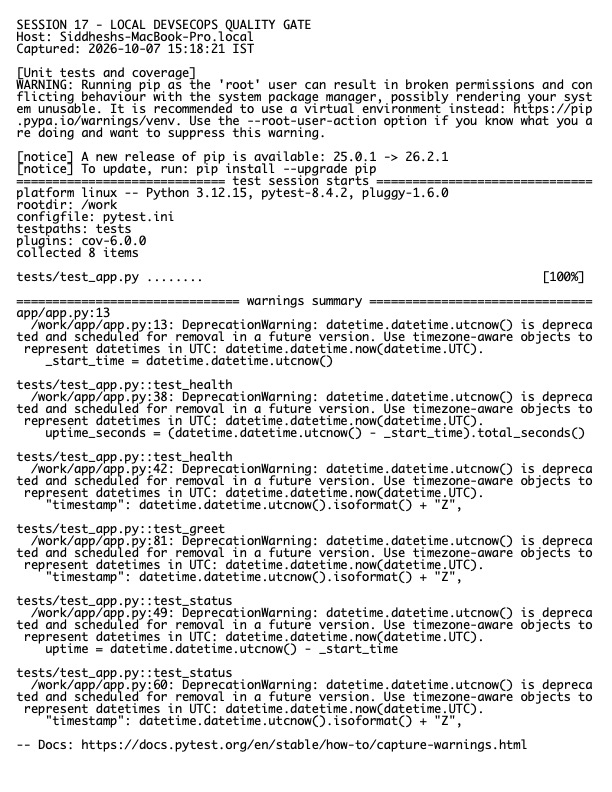

# Session 17 Homework — CI/CD and DevSecOps

**Host:** `Siddheshs-MacBook-Pro.local`

## Project

`../demo/` contains the Flask application, unit tests, Dockerfile, Kubernetes Deployment/Service, security policy, and `.github/workflows/devsecops.yml`.

The pipeline implements the requested sequence:

```text
Code -> Build -> Unit tests -> SAST -> SCA -> Secret scan
     -> Docker build -> Image scan -> Security gate
     -> Registry push -> Kubernetes deployment
```

The security controls cover static analysis, dependency vulnerability analysis, secret detection, Trivy image scanning, and blocking gates. Registry credentials are supplied through GitHub secrets. The image tag is tied to an immutable commit SHA, and Kubernetes is updated only after prior jobs pass.

## Security-gate policy

- Unit tests must pass.
- High-confidence SAST findings fail the job.
- Known vulnerable dependencies and leaked credentials fail the job.
- HIGH/CRITICAL image findings fail the release unless explicitly reviewed and time-bounded.
- Images are pushed and deployed only after all required checks succeed.

## Verification

Local tests, application import, Docker build, manifest validation, and workflow/security configuration checks are recorded below.



Raw output: `evidence.txt`.

> Registry push and a hosted pipeline run require valid GitHub authentication and repository ownership; neither is configured in this clone, so no external push was attempted.
