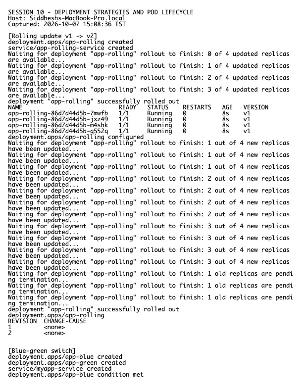

# Session 10 Homework — Pods, ReplicaSets, Deployments

**Host:** `Siddheshs-MacBook-Pro.local`  
**Namespace used for the lab:** `homework-s10`

## Completed demonstrations

| Strategy | Implementation | Verification |
|---|---|---|
| Rolling update | `../01-rolling-update/` | Rollout history/status and v1→v2 Pod replacement |
| Blue-green | `../02-blue-green/` | Service selector changed from `slot=blue` to `slot=green` |
| Canary | `../03-canary/` | Nine stable Pods and one canary Pod behind one Service |
| Recreate | `../04-recreate/` | v1 ReplicaSet scaled to zero before v2 became active |

The Pod lifecycle examples in `../pod-lifecycle/` cover Pending, Running, Succeeded, Failed, CrashLoopBackOff, ImagePullBackOff, probes, init containers, multi-container Pods, and termination. `kubectl get`, `describe`, and events were captured for representative healthy and deliberately failing Pods.

## Key observations

- A Deployment creates and owns ReplicaSets; ReplicaSets maintain the requested Pod count.
- RollingUpdate preserves availability by controlling surge and unavailable Pods.
- Blue-green makes release switching an atomic Service-selector change and enables fast rollback.
- This canary demo approximates 90/10 traffic using a 9:1 endpoint ratio; exact weighted routing normally needs an ingress controller or service mesh.
- Recreate introduces downtime but prevents old and new versions from running simultaneously.

## Evidence

Raw output: `evidence.txt`.
