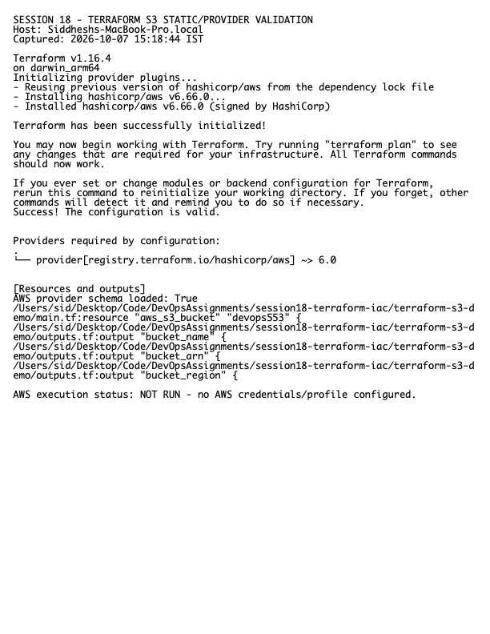

# Session 18 Homework — Terraform and IaC

**Host:** `Siddheshs-MacBook-Pro.local`  
**Terraform project:** `../terraform-s3-demo/`

## S3 workflow

The project contains provider/version constraints, variables, the S3 resource, outputs, `.gitignore`, and documentation. The local verification runs `terraform fmt -check`, `init -backend=false`, and `validate`. The intended credentialed lifecycle is:

```bash
terraform plan -out=tfplan
terraform apply tfplan
terraform show
terraform output
terraform destroy
```

The bucket name must be globally unique and should be provided through an uncommitted `terraform.tfvars` or CLI variable. Terraform state and credentials are excluded from Git.

## AWS research

- [IAM](./aws-services/01-iam/README.md)
- [EC2](./aws-services/02-ec2/README.md)
- [S3](./aws-services/03-s3/README.md)
- [VPC](./aws-services/04-vpc/README.md)
- [DynamoDB and RDS](./aws-services/05-dynamodb-rds/README.md)

## Evidence



Raw output: `evidence.txt`.

> `plan`, `apply`, and `destroy` against AWS were not run because this machine has no AWS CLI/profile or credentials. This avoids inventing output and avoids creating billable resources without an authorized account.
