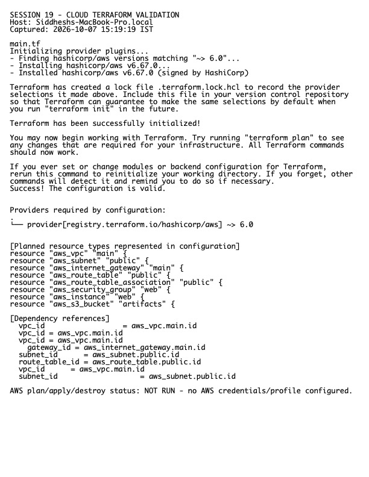

# Session 19 Homework — Cloud and Terraform in Action

**Host:** `Siddheshs-MacBook-Pro.local`  
**Project:** `../08-mini-project/`

## Architecture

```text
Internet
   |
Internet Gateway
   |
Public route table ---- VPC 10.20.0.0/16
   |                         |
Public subnet          Security group
   |                         |
  EC2                    HTTP/HTTPS

Terraform state tracks the resource graph; outputs expose IDs needed by operators or downstream modules. Explicit references create dependencies, while provider and variable files keep configuration reusable.
```

The repository modules cover providers, variables, resources, outputs, VPC/subnet, route table/Internet Gateway, security group, and the init/plan/apply/destroy workflow. `terraform fmt`, provider initialization, and `terraform validate` were executed locally.



Raw output: `evidence.txt`.

> AWS creation/destruction screenshots are intentionally absent because no AWS credentials are configured. Running `apply` without an authorized account would be impossible; running it against an assumed account could create billable resources.
