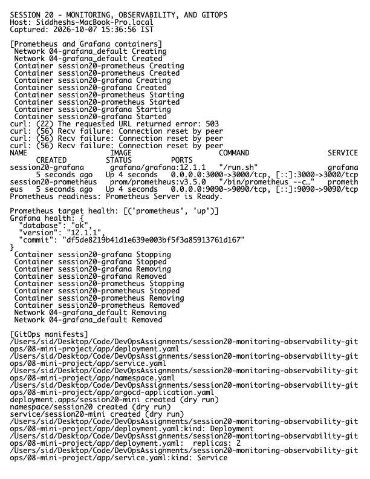

# Session 20 Homework — Monitoring, Observability, and GitOps

**Host:** `Siddheshs-MacBook-Pro.local`

## Monitoring demo

The Prometheus/Grafana Compose examples are in `../03-prometheus/` and `../04-grafana/`. Monitoring measures defined signals and evaluates alerts: CPU, memory, request rate/errors/latency, availability, logs, and health endpoints.

## Observability

- **Metrics** are numeric time series suited to dashboards, SLOs, trends, and alerts.
- **Logs** are timestamped event records useful for forensic and contextual diagnosis.
- **Traces** follow one request across services and expose latency/error paths.

Observability combines these signals so operators can investigate previously unknown failure modes. In Kubernetes, common sources include kube-state-metrics, node/container metrics, application `/metrics`, structured container logs, and OpenTelemetry traces.

## GitOps

Git stores the desired declarative state. A reconciler such as Argo CD continuously compares Git with the cluster and converges drift. Changes are reviewed, auditable, and reversible through Git. The mini-project in `../08-mini-project/` includes the Namespace, Deployment, Service, and Argo CD Application workflow.

```text
Developer -> reviewed Git commit -> Argo CD reconciliation -> Kubernetes
                                  <- health/drift status <-
```

## Evidence



Raw output: `evidence.txt`.

> A live Argo CD sync requires a student-owned reachable Git repository. This clone points at the instructor repository and has invalid GitHub authentication, so manifests were validated locally without creating a misleading external sync result.
