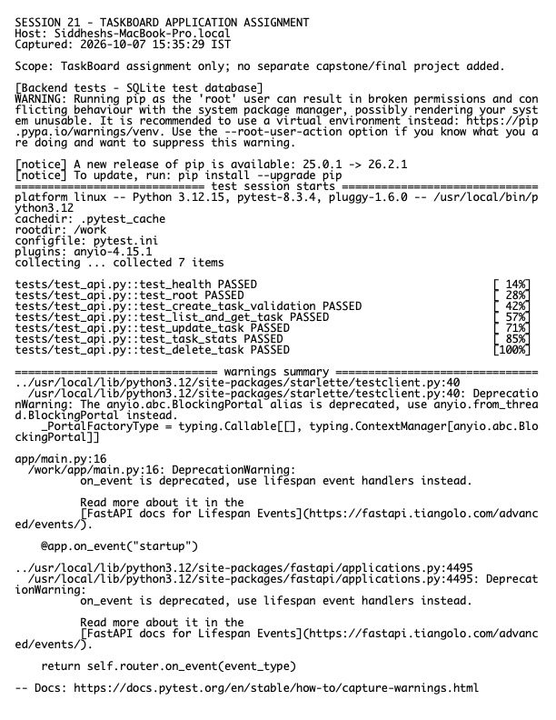

# Session 21 Assignment — TaskBoard Application

**Host:** `Siddheshs-MacBook-Pro.local`

This submission covers the TaskBoard application assignment already present in this session. Per instruction, it does **not** add or claim a separate capstone/final-project implementation.

## Included

- React/Vite responsive frontend.
- FastAPI CRUD API, health/readiness, metrics, SQLAlchemy, and Alembic migration.
- PostgreSQL local stack through Docker Compose.
- At least five Pytest API tests using SQLite rather than the production database.
- Non-root backend and frontend container images; frontend uses a Node build stage and unprivileged nginx runtime.
- GitHub Actions tests, frontend build, SHA-tagged images, Trivy HIGH/CRITICAL gates, GHCR push, and Helm deployment.
- Terraform VPC/EKS code, Kubernetes namespace, complete Helm chart, HPA, probes, PVC, Ingress, and ServiceMonitor.
- Prometheus values, load-test helper, and deliberately broken troubleshooting manifests.

## Local access

```text
Frontend: http://localhost:3000
API docs: http://localhost:8000/docs
Health:   http://localhost:8000/health
Metrics:  http://localhost:8000/metrics
```

## Architecture

```text
Browser -> unprivileged nginx frontend -> FastAPI backend -> PostgreSQL
                         |                    |
                      Ingress             /metrics
                         |                    |
                       Helm             Prometheus/Grafana
```

## Verification

Tests, frontend build, Docker Compose health/API checks, image user checks, Helm lint/template, Terraform validation, and Kubernetes manifest checks are captured below.



Raw output: `evidence.txt`.

> Hosted GitHub/GHCR and real AWS/EKS screenshots require valid account credentials. The configured GitHub token is invalid and no AWS credentials exist, so the submission records local equivalents and does not fabricate external success.
