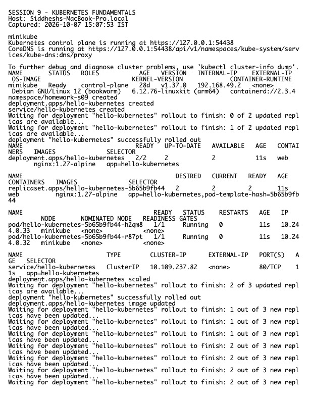

# Session 9 Homework — Kubernetes Fundamentals

**Host:** `Siddheshs-MacBook-Pro.local`  
**Cluster:** local Minikube  
**Namespace:** `homework-s09`

## Work completed

- Verified Minikube, the control plane, CoreDNS, node readiness, and the active context.
- Applied a Namespace, two-replica Deployment, and ClusterIP Service.
- Used `kubectl get`, `describe`, `logs`, `exec`, `rollout status`, and an in-cluster HTTP request.
- Inspected the main architecture components and completed a Kubernetes Basics-style deploy/expose/scale/update exercise.

## Architecture notes

The control plane contains the API server, scheduler, controller manager, and etcd. Worker nodes run kubelet, a container runtime, and kube-proxy. Declarative objects are submitted to the API server; controllers continuously reconcile actual state toward desired state. Services provide stable discovery and networking while Deployments manage ReplicaSets and Pods.

## Reproduce

```bash
kubectl apply -f namespace.yaml
kubectl apply -f deployment.yaml -f service.yaml
kubectl rollout status deployment/hello-kubernetes -n homework-s09
kubectl get all -n homework-s09 -o wide
kubectl scale deployment/hello-kubernetes --replicas=3 -n homework-s09
kubectl set image deployment/hello-kubernetes web=nginx:1.28-alpine -n homework-s09
kubectl rollout status deployment/hello-kubernetes -n homework-s09
```

## Evidence



The corresponding machine-readable output is in `evidence.txt`.
